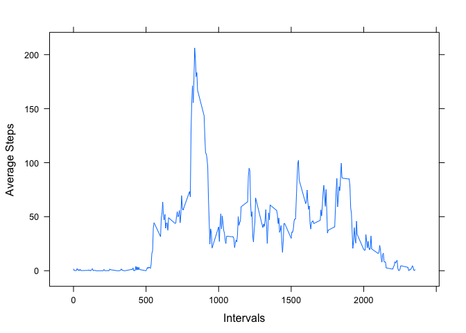
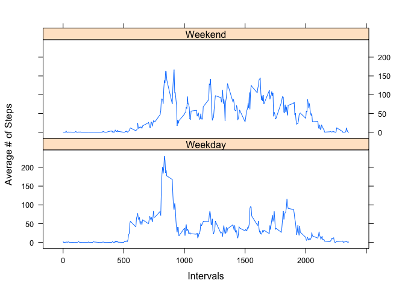

# Reproducible Research: Peer Assessment 1
Derek Wilson  
July 17, 2015  

## Required Packages

```r
library(plyr)
library(lattice)
```

## Loading and preprocessing the data

The data is loaded then enriched wiht a few additional useful columns

- **_dayofweek_**  -  factor with ordered levels indicating the day of the week,
starting with Monday
- **_weekday_**  -  factor indicating Weekday or Weekend  

                
                

```r
setwd('/Users/DMW/Coursera/Reproducible Research/RepData_PeerAssessment1')
activity <- read.csv('activity.csv')

activity$dayofweek <- factor(
        weekdays(as.Date(activity$date, format = '%Y-%m-%d'))
        ,levels = list(
                Monday = 'Monday'
                ,Tuesday = 'Tuesday'
                ,Wednesday = 'Wednesday'
                ,Thursday = 'Thursday'
                ,Friday = 'Friday'
                ,Saturday = 'Saturday'
                ,Sunday = 'Sunday')
        )
activity$weekday <- factor(ifelse(
        weekdays(as.Date(activity$date, format = '%Y-%m-%d')) 
                %in% c('Saturday','Sunday')
        ,'Weekend','Weekday')
        )
```


## What is mean total number of steps taken per day?

First I create the sum of steps for each of the 53 calendar days. I then plot the histogram of steps per day and provide the mean steps per day and median steps per day in a table.


```r
steps_by_day <- aggregate(steps ~ date, data = activity, FUN = sum)
mean_steps_per_day <- round(mean(steps_by_day$steps),2)
result_spd_mean <- format(mean_steps_per_day, digits=2, nsmall=2)
median_steps_per_day <- median(steps_by_day$steps)
result_spd_median <- format(median_steps_per_day, digits=2, nsmall=2)
```


```r
hist(
        steps_by_day$steps
        ,seq(0, ((max(steps_by_day$steps)%/%1000)+1)*1000, 2000)
        ,main = 'Histogram of Steps per Day'
        ,xlab = 'Steps per Day', ylab = 'Frequency of Days'
)
```

 

Mean | Median
:--- |:--- 
10766.19 | 10765


## What is the average daily activity pattern?
  

```r
avg_steps_by_interval <- aggregate(steps ~ interval
                        , data = activity
                        , FUN = 'mean'
                )
max_interval <- avg_steps_by_interval[
        avg_steps_by_interval$steps==max(avg_steps_by_interval$steps)
        , ]

result_max_interval <- format(max_interval$interval, digits=0, nsmall=0)
result_max_steps <- format(max_interval$steps, digits=2, nsmall=2)
```
  

```r
xyplot(steps ~ interval
       ,data = avg_steps_by_interval
       ,type='l'
       ,xlab = 'Intervals', ylab='Average Steps'
       )
```

 
  
Interval #835 is the interval with the highest average daily number of steps, 206.17.
  
  
  
## Imputing missing values

Now we impute for missing values for steps. First, lets see how many missing values we have.


```r
missing_steps <- sum(is.na(activity$steps))
```

Our data currently has 2304 missing values.

Let's see if we can use our average steps per daily interval to impute the values we are missing. The code below seeks our the missing values and applies the average for that interval.


```r
for (i in 1:nrow(activity[,])) {
        if (is.na(activity[i,1])) {
                activity[i,1] <- 
                        avg_steps_by_interval[
                                avg_steps_by_interval$interval==
                                        activity[i,3]
                                ,2]
        } 
}
```

We should expect a new historgram of steps per day to include these new imputed values. Further, given we are using derived averages and there we not many days with missing values, we should expect the mean to not change but the median to change a little.


```r
steps_by_day <- aggregate(steps ~ date, data = activity, FUN = sum)
mean_steps_per_day <- round(mean(steps_by_day$steps),2)
result_spd_mean <- format(mean_steps_per_day, digits=2, nsmall=2)
median_steps_per_day <- median(steps_by_day$steps)
result_spd_median <- format(median_steps_per_day, digits=2, nsmall=2)
```


```r
hist(
        steps_by_day$steps
        ,seq(0, ((max(steps_by_day$steps)%/%1000)+1)*1000, 2000)
        ,main = 'Histogram of Steps per Day - Imputed'
        ,xlab = 'Steps per Day', ylab = 'Frequency of Days'
)
```

 

As expected.

Mean | Median
:--- |:--- 
10766.19 | 10766.19

No change in the mean and the median increased to a value similar to the mean.


## Are there differences in activity patterns between weekdays and weekends?


```r
avg_steps_by_interval <- aggregate(steps ~ interval + weekday
                        , data = activity
                        , FUN = 'mean'
                )
```
  
We can see below that there is a difference in the activity pattern for average number of steps over intervals between weekdays and weekends. This individual performs a large number of steps in the early morning hours consistently on weekdays compared to weekends. 


```r
xyplot(steps ~ interval | weekday
       ,data = avg_steps_by_interval
       ,type='l'
       ,layout = c(1, 2)
       ,xlab = 'Intervals', ylab='Average # of Steps'
       )
```

 


